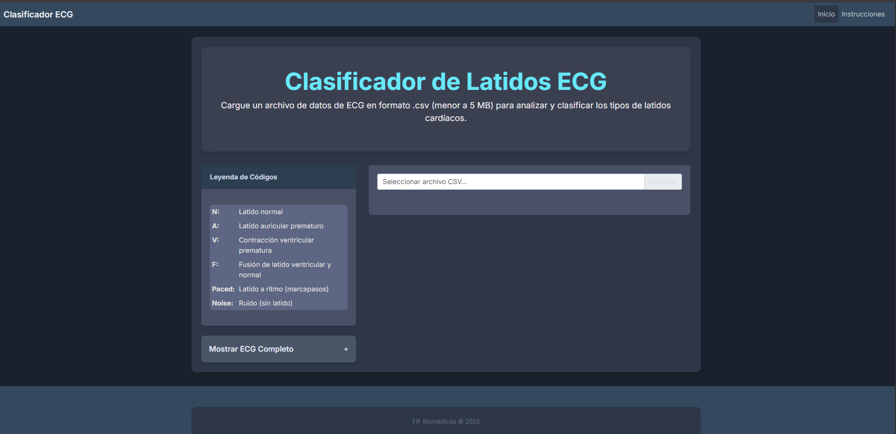
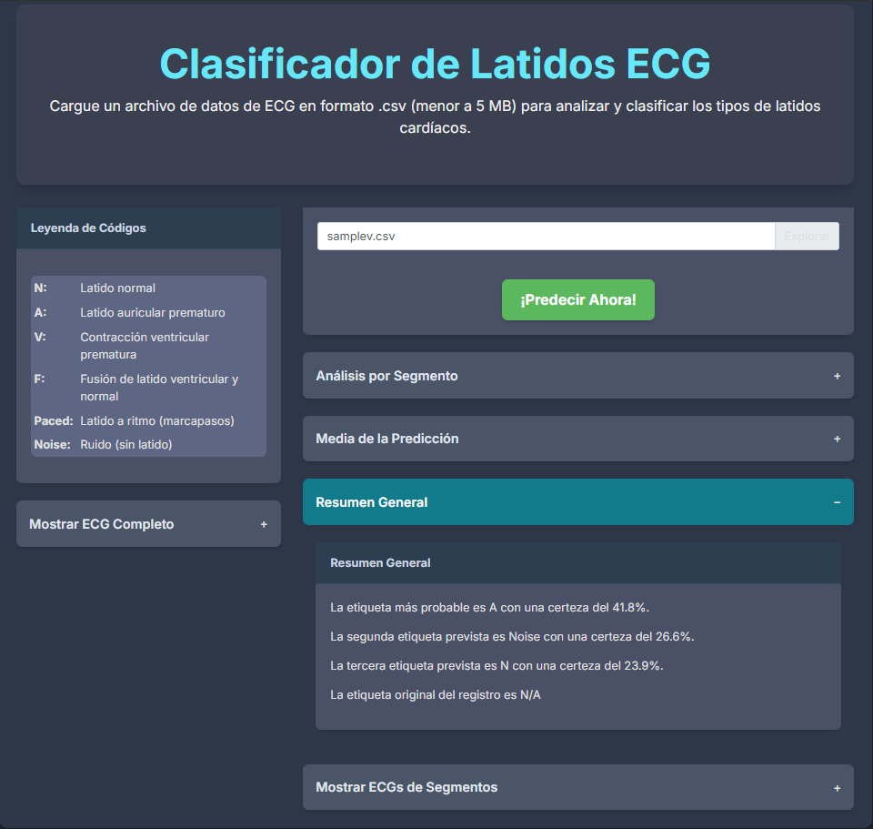

# Clasificación de ECGs mediante Deep Learning

[](./LICENSE)

Este repositorio contiene una implementación para la clasificación de señales de electrocardiogramas (ECGs) utilizando modelos de Deep Learning. El proyecto se inspira en las metodologías presentadas en las siguientes publicaciones:
* [Nature Medicine (s41591-018-0268-3)](https://www.nature.com/articles/s41591-018-0268-3)
* [arXiv (1707.01836)](https://arxiv.org/abs/1707.01836)

Para el entrenamiento y validación de los modelos, se ha utilizado el  conjunto de datos **MIT-BIH Arrhythmia Database**. Se puede encontrar más información sobre este dataset en PhysioNet: [https://physionet.org/physiobank/database/mitdb/](https://physionet.org/physiobank/database/mitdb/)

## Requisitos del Sistema

Para la ejecución del proyecto y evitar problemas de compatibilidad, es importante contar con las siguientes versiones especificas de dependencias instaladas en su sistema:

* **Python**: `3.12.9`
* **Flask**: `3.1.0`
* **gevent**: `24.11.1`
* **keras**: `3.9.1`
* **numpy**: `2.1.3`
* **pip-tools**: `7.4.1`
* **scikit-learn**: `1.6.1`
* **scipy**: `1.15.2`
* **six**: `1.17.0`
* **tensorflow**: `2.19.0`
* **tensorflow-metal**: `1.2.0`
* **tqdm**: `4.67.1`
* **Werkzeug**: `3.1.3`
* **wfdb**: `4.2.0`

## Configuración e Instalación

1.  **Clonar el Repositorio:**
    ```bash
    git clone [https://github.com/PatVela/TIF-Biomedica.git](https://github.com/PatVela/TIF-Biomedica.git)
    cd TIF-Biomedica
    ```
2.  **Crear y Activar Entorno Virtual:**
    Se recomienda el uso de un entorno virtual para gestionar las dependencias del proyecto de forma aislada.
    ```bash
    python -m venv ECG-env
    ```
    * **En Linux/macOS:**
        ```bash
        source ./ECG-env/bin/activate
        ```
    Verá `(ECG-env)` en su terminal, indicando que el entorno está activo.

3.  **Instalar Dependencias:**
    ```bash
    (ECG-env) pip install -r requirements.txt
    ```

## Configuración de Datos y Entrenamiento del Modelo

Una vez configurado el entorno, puede proceder con la descarga de datos y el entrenamiento del modelo:

1.  **Descargar y Preprocesar Datos:**
    Este script se encargará de obtener el conjunto de datos MIT-BIH y realizar el preprocesamiento necesario.
    ```bash
    (ECG-env) python src/data.py --downloading True
    ```
2.  **Entrenar el Modelo de Deep Learning:**
    Este comando inicia el proceso de entrenamiento de la red neuronal. El número de épocas puede ser ajustado según sea necesario.
    ```bash
    (ECG-env) python src/train.py --epochs 20
    ```

## 🧪 Pruebas y Predicción

El proyecto permite realizar predicciones utilizando datos del desafío CINC2017 o sus propios archivos CSV.

1.  **Ejecutar Predicciones:**
    ```bash
    (ECG-env) python src/predict.py --cinc_download True
    ```
    El argumento `--cinc_download True` es necesario solo la primera vez para descargar los datos de CINC2017. El script seleccionará aleatoriamente un registro y mostrará las predicciones del modelo.

2.  **Personalización de Parámetros:**
    Para ajustar parámetros relacionados con la descarga, entrenamiento o predicción (como rutas, tamaños de lote, etc.), modifique el archivo `src/config.py`.

## Aplicación Web (Flask)

Se ha desarrollado una aplicación web utilizando Flask para demostrar interactivamente las capacidades del modelo de clasificación de ECG.

1.  **Ejecutar la Aplicación Web:**
    Con el entorno virtual activado:
    ```bash
    (ECG-env) python src/app.py
    ```
    La aplicación estará disponible en su navegador, generalmente en `http://127.0.0.1:5000/`.

2.  **Interfaz de Usuario:**
    La interfaz inicial de la aplicación se muestra a continuación:
    

3.  **Carga de Archivos CSV y Predicción:**
    La aplicación permite la carga de archivos CSV que contengan señales de ECG.

    **Nota Importante sobre el Formato CSV:**
    Es crucial que el archivo CSV proporcionado incluya la frecuencia de muestreo de la señal. **El primer valor de la primera columna del archivo debe ser la frecuencia de muestreo (sampling rate)**. Se incluye un archivo de ejemplo en `static/asset` para referencia.

    Una vez cargado el archivo y activada la predicción, los resultados se visualizarán de manera similar a:
    

## Referencias

### Artículos de Investigación Originales:

* Rajpurkar, P., et al. (2018). Cardiologist-level arrhythmia detection and classification in ambulatory electrocardiograms using a deep neural network. *Nature Medicine*, 24(12), 1761-1765.
    [[Enlace a Nature Medicine]](https://www.nature.com/articles/s41591-018-0268-3)
* Rajpurkar, P., et al. (2017). Deep Neural Networks for ECG Classification. *arXiv preprint arXiv:1707.01836*.
    [[Enlace a arXiv]](https://arxiv.org/abs/1707.01836)

### Código Fuente de los Autores:

* Repositorio oficial de los autores de las publicaciones mencionadas:
    [https://github.com/awni/ecg](https://github.com/awni/ecg)

### Proyectos Relacionados:

* Un enfoque Deep Learning para el desafío CINC2017:
    [https://github.com/fernandoandreotti/cinc-challenge2017/tree/master/deeplearn-approach](https://github.com/fernandoandreotti/cinc-challenge2017/tree/master/deeplearn-approach)
