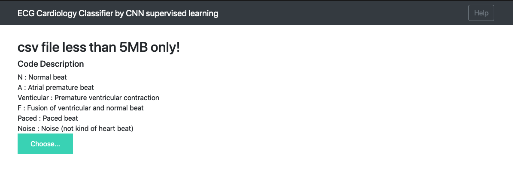
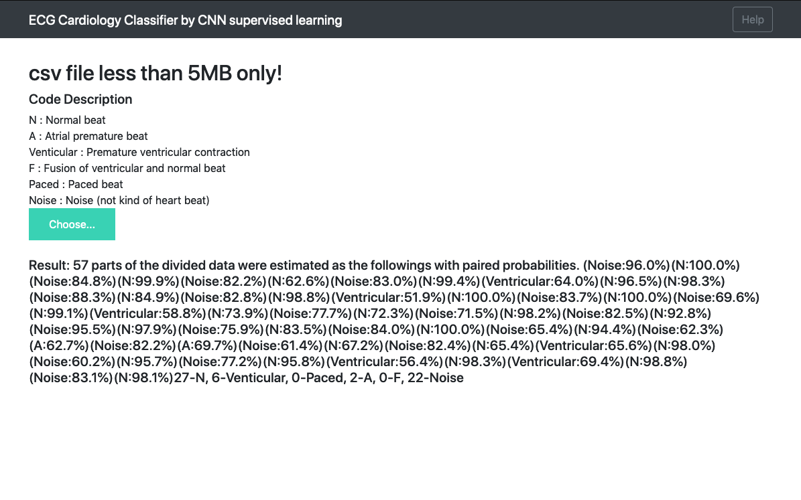

[](./LICENSE)

### ECG classification using MIT-BIH dataset 

Este repositorio es una implementación de https://www.nature.com/articles/s41591-018-0268-3 y https://arxiv.org/abs/1707.01836 y se enfoca en el entrenamiento usando el conjunto de datos MIT-BIH.

Introducción al conjunto de datos MIT-BIH en physionet: https://physionet.org/physiobank/database/mitdb/

### Dependencias (Actualizado, 1 de abril de 2025)

Python == 3.12.9
- Flask==3.1.0
- gevent==24.11.1
- keras==3.9.1
- numpy==2.1.3
- pip-tools==7.4.1
- scikit-learn==1.6.1
- scipy==1.15.2
- six==1.17.0
- tensorflow==2.19.0
- tensorflow-metal==1.2.0
- tqdm==4.67.1
- Werkzeug==3.1.3
- wfdb==4.2.0

### Configuración de datos y entrenamiento
```
$ git clone https://github.com/PatVela/TIF-Biomedica.git
$ cd TIF-Biomedica
$ python -m venv ECG-env
$ source ./ECG-env/bin/activate
(ECG-env) $ pip install -r requirements.txt
(ECG-env) $ python src/data.py --downloading True
(ECG-env) $ python src/train.py --epochs 20
```
Ahora tienes un modelo entrenado para clasificación de ECG.

### Prueba
Predice una anotación de los datos CINC2017 o tus propios datos (archivo csv)

Selecciona aleatoriamente uno de los datos y predice los fragmentos de la señal.

Ejecuta predict.py en el entorno virtual que ya configuramos.
```
(ECG-env) $ python src/predict.py --cinc_download True
```
La opción --cinc_download se usa la primera vez para descargar los datos de CINC2017.

Consulta src/config.py para poder personalizar tus parámetros.

### Ejemplo con Jupyter notebook

En caso de que no tengas una GPU con un rendimiento decente, podrías usar Google Colab. Sigue el notebook de Jupyter. [Jupyter notebook](https://github.com/physhik/ecg-mit-bih/blob/master/src/practice/ecg_mit.ipynb).


### Aplicación web con Flask

La aplicación web con Flask está basada en el repositorio de keras-flask-deploy Github repo.

### Ejecutar app.py
```
(ECG-env) $ python src/app.py
```



y elige una señal de ritmo cardíaco en formato csv, haz clic en predecir y observa el resultado.



Se ha incluido un archivo csv en el directorio static/asset. El primer valor de la columna se toma como la frecuencia de muestreo en la app web. 
Si usas tu propio archivo csv con señal de ECG, asegúrate de insertar la frecuencia de muestreo al inicio también. 

### Reference to 

Los artículos de investigación originales:
https://www.nature.com/articles/s41591-018-0268-3
https://arxiv.org/abs/1707.01836

El código open source de los autores:
https://github.com/awni/ecg

También destacable:
https://github.com/fernandoandreotti/cinc-challenge2017/tree/master/deeplearn-approach
